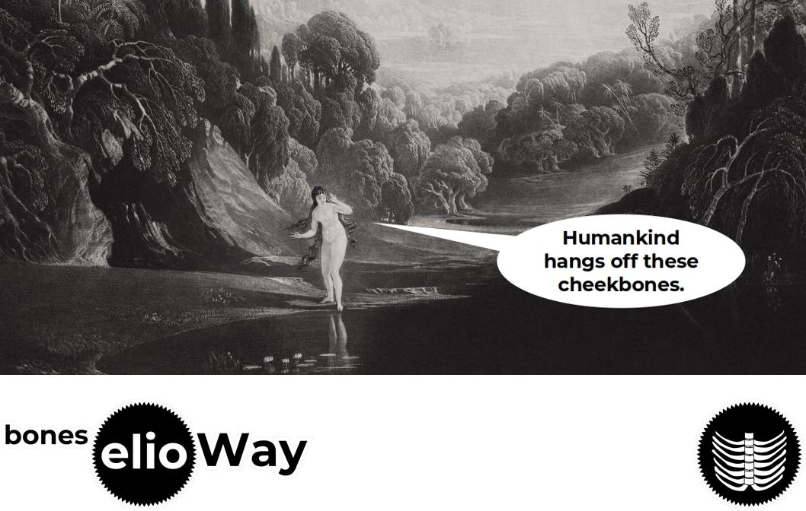

> Middleware and server side stack, **the elioWay**

# bones 

3. [bones Documentation](https://elioway.gitlab.io/eliobones/bones/)

## Installing

- [Installing bones](https://elioway.gitlab.io/eliobones/bones/installing.html)

## Requirements

- [elioFaithful Prerequisites](https://elioway.gitlab.io/eliobones/installing.html)

## Seeing is Believing

```bash
git clone https://gitlab.com/eliobones/bones.git
cd bones
npm i

# prints "boneslet" to screen
npm run bones -- Action

# Default: print a boneslet to screen
npm run bones

# print a boneslet to screen
npm run bones -- --boneslet

# print an Action boneslet
npm run bones -- Action

# print an Thing schema
npm run bones -- --schema

# include SchemaOrg comments to your schema
npm run bones -- --schema --comments

# change the depth to which ThingBuilder will seek less primitively "typed" properties and relationships.
npm run bones -- --schema --depth 2

# write any result into this folder.
npm run bones -- --write"."

# write any result into any folder.
npm run bones -- --write"./myThings/"

# list all the subtypes of Thing
npm run bones -- --list

# list all the subtypes of Action
npm run bones -- Action --list
```

## Nutshell

- [bones Quickstart](https://elioway.gitlab.io/eliobones/bones/quickstart.html)

## License

[MIT](license)


